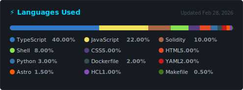

# stack-stats


<i>Self-hosted GitHub Action that generates a language stats SVG card from all your repositories — public and private — with no third-party servers or npm dependencies.</i>

<div align="center">
    
</div>

## Measurement Model

**stack-stats** uses GitHub's built-in byte count per language, the same data behind the colored bar on every repository page. Byte count is aggregated across all non-fork repositories, then the top N languages are ranked and expressed as percentages relative to each other.

| Metric | Approach | Rationale |
|---|---|---|
| Unit | Bytes of source code | Reflects actual code volume; not skewed by config file count |
| Scope | All owned repositories | `affiliation=owner` excludes org repos you merely collaborate on |
| Forks | Excluded by default | Prevents upstream language distortion; opt-in via `INCLUDE_FORKS=true` |
| Percentage base | Relative to top N | Progress segments fill the full bar width; values sum to 100% |

## Configuration

All behavior is controlled through environment variables. No config files are required.

| Variable | Required | Default | Description |
|---|---|---|---|
| `GITHUB_TOKEN` | Yes | — | Personal Access Token with `repo` scope |
| `GITHUB_USERNAME` | Yes | — | GitHub username whose repos are fetched |
| `TOP_N` | No | `10` | Number of languages to display |
| `INCLUDE_FORKS` | No | `false` | Set to `true` to include forked repos |
| `OUTPUT_FILE` | No | `stats.svg` | Output file path |

## SVG Card

The generated card renders as a stacked horizontal bar followed by a three-column legend. Colors match the official **GitHub Linguist** palette. The card uses a dark background (`#161b22`) and is designed for GitHub's dark-mode profile pages.

| Element | Details |
|---|---|
| Stacked bar | 455 px wide, 10 px tall, rounded ends, segments proportional to percentage |
| Legend | 3-column grid, colored dot + language name + percentage per entry |
| Accent color | `#00D9FF` for the title; `#8b949e` for secondary text |
| Timestamp | "Updated Month Day, Year" rendered top-right in the card |
| Unknown languages | Rendered with fallback color `#8b949e` |

Languages with official Linguist colors include: TypeScript, JavaScript, Solidity, Shell, Rust, CSS, HTML, Astro, Python, Go, Vue, Svelte, Java, Kotlin, Swift, PHP, Ruby, C++, SCSS, Dart, and 10 others. To add a missing language, append an entry to the `LANGUAGE_COLORS` object in `generate-stats.mjs`. The full color list is at [ozh/github-colors](https://github.com/ozh/github-colors).

## Data Collection

The script fetches repositories with a paginated loop over `GET /user/repos?visibility=all&affiliation=owner&per_page=100`, following `Link: rel="next"` headers until all pages are consumed. For each non-fork repo it calls `GET /repos/{owner}/{repo}/languages`, which returns a byte count per detected language. Both calls use the GitHub REST API v3 with version header `2022-11-28`.

| Endpoint | Purpose |
|---|---|
| `GET /user/repos` | List all owned repos with pagination support |
| `GET /repos/{owner}/{repo}/languages` | Byte count per language for a single repo |

Rate limit consumption scales as `ceil(R / 100) + R` requests for R non-fork repos. For 200 repos this is 202 requests out of the 5 000/hour budget for authenticated tokens. Remaining budget is logged after each response; a warning is printed if it drops below 50.

## System Architecture

| Component | Role |
|---|---|
| **`generate-stats.mjs`** | Core script: paginates GitHub API, aggregates bytes, renders `stats.svg` |
| **GitHub Actions workflow** | Scheduled runner: executes the script daily and commits the output |
| **`stats.svg`** | Versioned artifact committed to the repo and served via GitHub's raw CDN |
| **`raw.githubusercontent.com`** | CDN that serves the committed SVG to profile README embeds |
| **GitHub REST API v3** | Data source for repository list and per-repo language byte counts |

## Technology Stack

- **Runtime**: Node.js 18+ (native `fetch`, no polyfill required)
- **CI/CD**: GitHub Actions with `ubuntu-latest` runner
- **Output format**: SVG (inline XML, no canvas or external renderer)
- **API**: GitHub REST API v3, authenticated with a Personal Access Token
- **Dependencies**: None — standard library only (`fs.writeFileSync`, `process.env`)

## Key Features

1. **Zero npm dependencies** — runs with `node generate-stats.mjs` and nothing else; no `npm install` step in CI
2. **Private repository support** — fetches all repos owned by the authenticated user when the PAT has `repo` scope
3. **Self-hosted output** — the SVG is committed to your own repo and served from `raw.githubusercontent.com`, not a third-party server
4. **Automatic daily refresh** — a cron-based GitHub Action regenerates and commits the SVG every 24 hours
5. **Idempotent commits** — the workflow skips the commit entirely when the SVG has not changed, avoiding noise in the git log
6. **Full pagination** — handles accounts with any number of repos by following `Link` headers across all API pages
7. **Graceful degradation** — individual repo fetch failures (404, permission errors) are skipped and logged without aborting the run

## Testing Strategy

The script is validated by running it locally with a real token before deploying: `GITHUB_TOKEN=... GITHUB_USERNAME=... node generate-stats.mjs`. The generated `stats.svg` is opened in a browser to verify layout, color accuracy, and percentage values. The GitHub Actions workflow is tested via the manual `workflow_dispatch` trigger before relying on the scheduled cron. Correctness of the byte-count aggregation can be spot-checked against the language bar on any individual repository page.

## Project Setup

1. Fork this repository or copy `generate-stats.mjs` and `.github/workflows/update-stats.yml` into a new repo.

2. Generate a Personal Access Token at [github.com/settings/tokens](https://github.com/settings/tokens):
   - Type: Classic token
   - Scope: `repo` (required for private repository access)
   - Expiration: set to your preference; no expiration is valid for a personal tool

3. Add the token and username to the repo settings under **Settings → Secrets and variables → Actions**:

   | Tab | Name | Value |
   |---|---|---|
   | Secrets | `STATS_TOKEN` | Your PAT |
   | Variables | `GH_USERNAME` | Your GitHub username (`GITHUB_` prefix is reserved by GitHub) |

4. Trigger the first run manually: **Actions → Update Language Stats → Run workflow**.
   After ~1 minute, `stats.svg` is committed to the repo.

5. Verify the output by opening the raw URL in a browser:

   ```
   https://raw.githubusercontent.com/YOUR_USERNAME/stack-stats/main/stats.svg
   ```

6. Embed in your profile README (`YOUR_USERNAME/YOUR_USERNAME/README.md`):

   ```markdown
   <div align="center">
     
   </div>
   ```

7. Optional — run locally to preview before pushing:

   ```bash
   GITHUB_TOKEN=ghp_yourtoken GITHUB_USERNAME=YourUsername node generate-stats.mjs
   ```

---

Built for GitHub profile READMEs.
